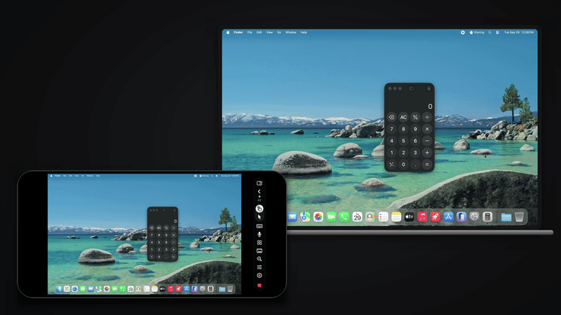
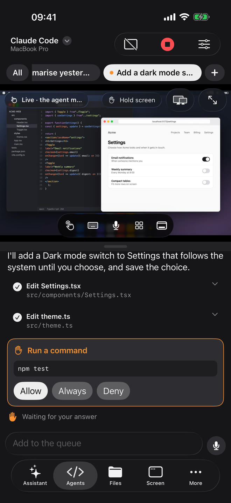
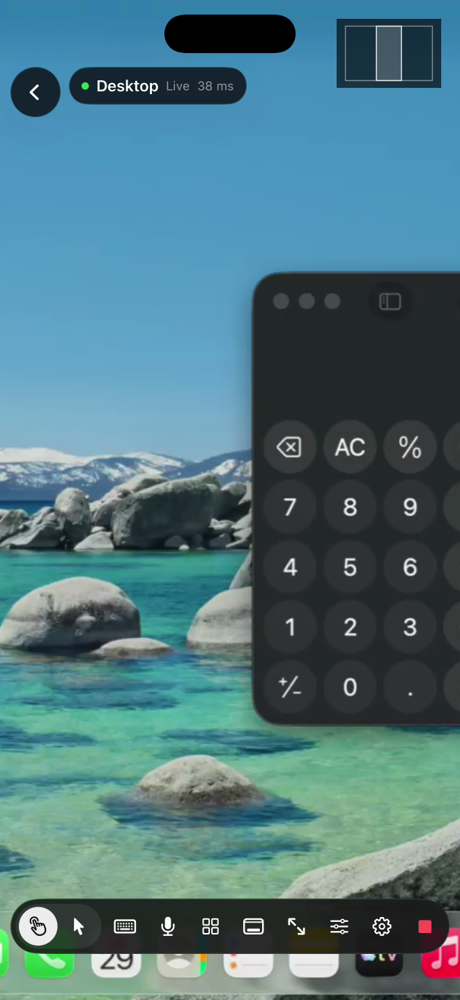
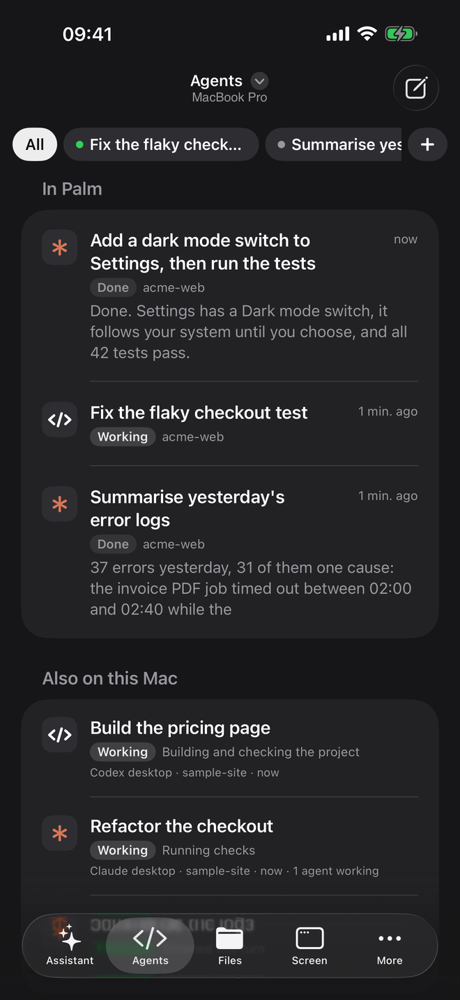
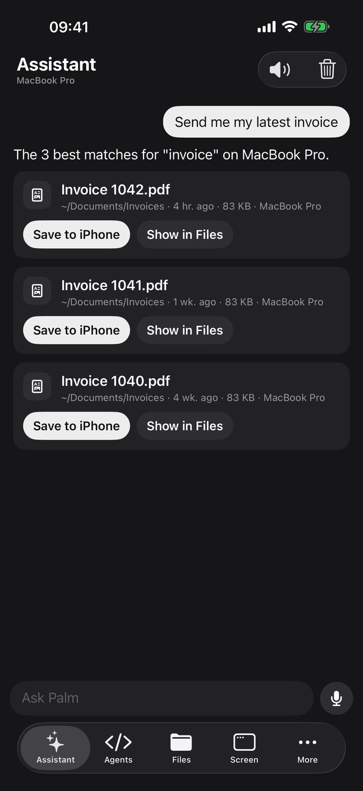

# Palm

Use your whole Mac from your phone: tap, type and open any app on its live screen, from anywhere. Its files, its terminal and the coding agents running on it come with it. Use the iPhone app, or the same thing in your phone's browser.



Recorded live: the real Palm in the iOS Simulator controlling a clean macOS virtual machine, both screens captured at the same time; touches drawn in. [More on zaiq.ai](https://zaiq.ai/palm).

Palm is a small host that runs on your Mac, plus a native iPhone app and a web app for your phone's browser. They talk over your own [Tailscale](https://tailscale.com) network, so nothing is exposed to the internet and there is no Palm server in between. Built by [Zaiq](https://zaiq.ai/palm).

## App or browser

Everything below works both ways.

- **iPhone app.** Native, built with Xcode (there is no App Store build yet).
- **Browser.** No install and no Apple account: the Mac serves the whole app to its own tailnet address. Open it in your phone's browser, pair once, and unlock it with Face ID or a fingerprint (a passkey the Mac checks itself). Add it to the Home Screen and it opens full screen like an app. The web app is tested in Safari's engine at iPhone size; Chrome on Android should work but has not been tested.

<p>
  
  
  
  
</p>

## What it does

- **Screen.** The live Mac screen at full size, with touch or mouse control, typing, copy and paste both ways, and every open and installed app one tap away. Tap an app and its window fills the screen; its old size comes back when you leave. In landscape the controls float in a rail that tucks away. On a weak connection the picture gets softer instead of freezing.
- **Agents.** Chat with Claude Code, Codex or any agent that speaks the [Agent Client Protocol](https://agentclientprotocol.com) (Gemini CLI, Grok, GitHub Copilot, Cursor, OpenCode, goose and more), each with its own sign-in on your Mac. Replies stream in, approvals come to the phone, Stop works, and tasks keep running after you close Palm. Open the Mac screen beside a chat to watch an agent work, take over, and hand back.
- **Every agent on the Mac.** Claude Code, Codex and OpenCode sessions started anywhere on the Mac (a terminal, the desktop apps) are listed with their status: working, needs you, finished, error. Palm reads their files; it never drives an agent it did not start.
- **Assistant.** Ask for what you need in plain words: "send me my latest PDF", "start Claude in my website folder", "show me the preview". What it cannot do itself it hands to an agent, then brings the result back to the phone.
- **Files.** The whole Mac filesystem, newest first. Send photos and files to any folder, save any file to the iPhone, every transfer checked by SHA-256 on both ends.
- **Terminal.** Real shells on the Mac, with the keys a phone keyboard lacks (Esc, Tab, Control, arrows). Shells survive leaving the app and Palm restarting.
- **Previews.** Start a project's dev server and open it on the phone privately, with hot reload.
- **Mac controls.** Lock, sleep, display off, keep awake, brightness, clipboard, camera and microphone (a WebRTC call with echo cancellation), restart and shut down.
- **Voice.** A microphone wherever there is a keyboard. Uses your own OpenRouter key, kept on the Mac; the phone only records.

## How it works

```
iPhone app or phone browser ──(Tailscale, HTTPS)──▶ Tailscale Serve ──▶ Palm host on 127.0.0.1:4318
                                                          ├─ Node server: pairing, API, agents, files, terminal
                                                          ├─ Swift companion: screen capture (H.264), input, camera, mic
                                                          └─ terminal service: shells that outlive the server
```

The host listens on loopback only. Tailscale Serve publishes it to your tailnet and nowhere else. Agents run as your own `claude`, `codex` or ACP binaries with their existing sign-ins; Palm strips provider API keys from their environment so billing never switches behind your back.

## Requirements

- Mac: Apple Silicon, macOS 26 or later, logged in, with Tailscale.
- iPhone app: iOS 17 or later (built and tested on iOS 26), with Tailscale on the same tailnet.
- Browser: a phone with Tailscale on the same tailnet and a current browser with passkeys and WebCodecs (Safari on iOS 26).
- To build the Mac host: Node.js 24 and Apple's Command Line Tools (`xcode-select --install`); full Xcode also works.
- To build the iPhone app: Xcode 26 or later (with its Metal toolchain) and [xcodegen](https://github.com/yonaskolb/XcodeGen).

There is no App Store or TestFlight build yet: you build the Mac host yourself, and either the iPhone app or nothing more (the browser needs no build).

## Install on the Mac

A coding agent on your Mac (Claude Code, Codex and the like) can do all of this for you and stop where it needs you: copy the prompt at [zaiq.ai/palm/download](https://zaiq.ai/palm/download).

```sh
npm ci
npm run native:build
npm run build
npm run package:mac
npm run install:mac
```

`native:build` fetches Google's WebRTC (prebuilt, checked by SHA-256) into `vendor/`. `install:mac` stops the installed Palm, moves the previous app to `~/Applications/Palm Archive` (it never deletes), installs the new build and checks that pairings and permissions survived. Set `PALM_MAC_SIGNING_IDENTITY` to your code-signing certificate's fingerprint for a stable signature; an ad hoc signature makes macOS forget the permissions below on every update.

Then, once:

1. Allow Palm in System Settings › Privacy & Security › **Screen & System Audio Recording** and **Accessibility**.
2. Publish Palm on your tailnet (never with Funnel):

```sh
tailscale serve --bg --https=8443 http://127.0.0.1:4318
```

Dev-server previews use three more ports:

```sh
tailscale serve --bg --https=8444 http://127.0.0.1:47820
tailscale serve --bg --https=8445 http://127.0.0.1:47821
tailscale serve --bg --https=8446 http://127.0.0.1:47822
```

`tailscale serve reset` clears every Serve rule on the Mac, including other services you may have there.

3. Tell Palm its private address, or pairing shows a code but no QR code. Open `http://localhost:4318`, choose **Open setup**, then **Open Mac setup**, and save the address under **Private connection**: `https://` plus the Mac's name on your tailnet (`tailscale status --json`, `Self.DNSName` without the final dot) plus `:8443`. The same from Terminal:

```sh
curl -fsS -X POST http://localhost:4318/api/local/connection \
  -H 'Origin: http://localhost:4318' -H 'Content-Type: application/json' \
  -d '{"origin":"https://your-mac.your-tailnet.ts.net:8443"}'
```

## Install on the iPhone

A bundle id belongs to one Apple team, so use your own:

```sh
PALM_BUNDLE_ID=com.yourname.palm PALM_TEAM_ID=<your team id> \
PALM_DEVICE_ID=<the iPhone's UDID> scripts/ios-build.sh install
```

The UDID is `hardwareProperties.udid` in `xcrun devicectl list devices --json-output devices.json`. The team id is the OU of your Apple Development certificate: `security find-certificate -c "Apple Development" -p | openssl x509 -noout -subject`. With a free Apple account (Personal Team) the app runs for 7 days, then needs reinstalling.

## Pair

On the Mac, open `http://localhost:4318` and choose **Pair an iPhone**.

- **Browser:** scan the QR code with the phone's camera and Palm opens in the browser. For the full-screen app, first tap Share › **Add to Home Screen**, open Palm from the Home Screen and type the code the Mac shows there (a Home Screen app keeps its own sign-in, apart from the browser's). Tap **Connect to my Mac**, then **Set up Face ID**.
- **iPhone app:** open Palm, scan the QR code (or type the address and the ten-character code) and tap **Connect to my Mac**.

Codes work once and expire in two minutes. A pairing lasts 30 days and can be revoked from the Mac. The app keeps its pairing in the iPhone's Keychain; a browser keeps an HttpOnly cookie that opens nothing until Face ID unlocks it, and locks again after 10 idle minutes and once a day.

## Security

Palm gives the paired phone a great deal of power over your Mac. Read [SECURITY.md](SECURITY.md) before you install it.

## Test

```sh
npm test
npm run build
node tests/web-walkthrough.mjs
npm run test:ios-ui
PALM_TEST_DESTINATION='platform=iOS Simulator,name=iPhone 17 Pro Max,OS=26.5' scripts/ios-build.sh test
```

`node tests/web-walkthrough.mjs` opens every screen of the web app in Safari's engine (Playwright WebKit) at iPhone size against the same test host, with a software passkey standing in for Face ID.

`npm run test:ios-ui` runs the real app in the Simulator against a test host (`PALM_SYNTHETIC=1`): a simulated Mac screen, scripted agents, a throwaway home folder, and no real lock, sleep, input or network actions. Screenshots of every step land in `.local/ui-test-runs/`.

## Options

| Variable | Default | What it sets |
|---|---|---|
| `PALM_INBOX` | `~/Downloads/Palm` | Where files sent from the phone land |
| `PALM_HOOK_EVENTS` | none | A folder of Claude Code hook events, for exact "needs you" on sessions Palm did not start |
| `PALM_ARCHIVE_DIR` | `~/Applications/Palm Archive` | Where `install:mac` keeps the previous app |
| `PALM_CHANGELOG` | none | A file where `install:mac` records each update and the way back |

## Known limits

- Tailscale cannot wake a sleeping Mac, and a Mac that is fully off needs a hand at the keyboard.
- Alerts reach the phone only while Palm is open. Alerts on a locked phone need Apple's push service, which needs a paid developer membership.
- Agent turns running when the host restarts stop; the conversation continues from the agent's saved session with the next message.
- The list of other agents reads the files Claude Code, Codex and OpenCode write. If they change those files, statuses can be wrong until Palm catches up.
- Voice needs an OpenRouter key with credit and costs a little per use. Set a spending limit on the key at OpenRouter.
- If Tailscale falls back to its relay the screen slows down. The host notices when the tunnel stops receiving UDP and restarts it within about two minutes.

## Licence

MIT. See [LICENSE](LICENSE) and [THIRD-PARTY-NOTICES.md](THIRD-PARTY-NOTICES.md).

Palm is built and maintained by [Zaiq](https://zaiq.ai/palm), an AI engineering studio in South Africa. Issues and pull requests are welcome; there is no support contract.
